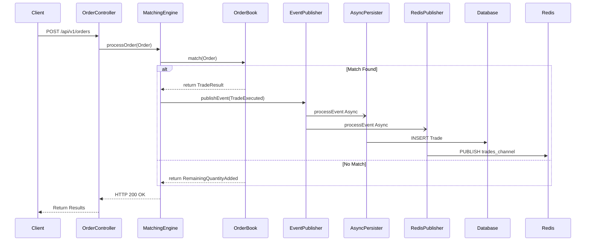

# System Architecture

## Design Overview

The In-Memory Matching Engine is designed for high-performance trading of multiple asset pairs. It operates as a stateless matching node that processes incoming orders in memory and asynchronously persists trade data to PostgreSQL and Redis. A lightweight static web interface is packaged with the application for easy interaction.

### Data Flow

1. **Web UI / REST API**: The `OrderController` receives limit orders from the frontend or external API clients.
2. **Matching**: `MatchingEngineService` routes orders to the correct `OrderBook`.
3. **Execution**: The `OrderBook` matches orders using a strict price-time priority algorithm.
4. **Egress**: Matching results are published as internal Spring events.
5. **Side Effects**: Independent listeners handle trade persistence (Postgres) and market data broadcasting (Redis).

## Core Components

### OrderBook

The `OrderBook` is the central data structure. It manages two internal `TreeMap` collections (one for Bids, one for Asks).

* **Price Levels**: Each entry in the map represents a price level.
* **Time Priority**: Each price level contains a `Deque` of orders, ensuring FIFO (First In, First Out) execution.
* **Concurrency**: Access to a specific `OrderBook` is guarded by a `ReentrantLock` to ensure atomic matching without blocking other trading pairs.

### Matching Algorithm

The engine iterates through the opposing side of the book starting from the best available price. For a buy order, it matches against the lowest asks; for a sell order, it matches against the highest bids. Remaining quantity after matching is added to the book as a resting limit order.

### Trade Event Pipeline

Matching events are dispatched using Spring's `ApplicationEventPublisher`. By using `@Async` listeners, the engine keeps the matching latency low, as database and network I/O occur in the background threads.

* **Persistence**: `AsyncTradePersister` stores completed trades for auditing and historical reporting into PostgreSQL.
* **Market Data**: `MarketDataPublisher` sends trade updates to Redis for real-time dashboards or downstream services.

### Frontend UI

The UI is built with vanilla HTML, CSS, and JavaScript. Hosted statically from `src/main/resources/static`, it provides a lightweight interaction layer.

* Polls the `/api/v1/orderbook` endpoint to visualize liquidity.
* Submits REST requests to `/api/v1/orders` asynchronously.

## Concurrency and Scaling

* **Ticker Parallelism**: Since locks are per-ticker, the system can match orders for different assets simultaneously without contention.
* **Lazy Initialization**: Order books are created only when a ticker is first encountered, optimized via `ConcurrentHashMap.computeIfAbsent`.

## Persistence Strategy

The system is designed for maximum speed and therefore does not recover resting orders from the database on restart. PostgreSQL is used as an immutable record of truth for executed trades, while the matching state itself is considered transient.
